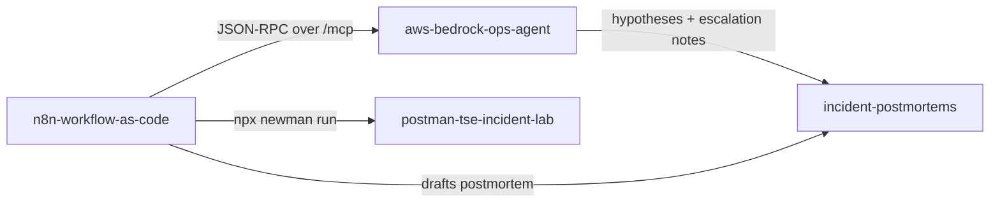

  

&ensp;&ensp;&ensp;

---

### ✦ TECH STACK

<table>
  <tr><td align="right" width="130">Support&nbsp;Ops</td><td>     </td></tr>
  <tr><td align="right" width="130">AI&nbsp;&amp;&nbsp;Agents</td><td>    </td></tr>
  <tr><td align="right" width="130">Infra</td><td>    </td></tr>
  <tr><td align="right" width="130">Tools</td><td>       </td></tr>
</table>

---

### ✦ FEATURED WORK

#### 📂 [aws-bedrock-ops-agent](https://github.com/h-vance/aws-bedrock-ops-agent) &nbsp;·&nbsp; [live demo ↗](https://aws-bedrock-ops-agent.onrender.com/)
*An L2 triage copilot that ingests incident evidence bundles and returns ranked hypotheses, recommended checks, and escalation-ready notes. The same triage logic is served over both REST and the Model Context Protocol from a single deploy, and every Bedrock call is traced with OpenTelemetry GenAI semantic conventions.*

#### 📂 [n8n-workflow-as-code](https://github.com/h-vance/n8n-workflow-as-code)
*Four n8n workflows authored as version-controlled TypeScript and compiled to importable JSON. Three of the four call real systems instead of mocking them: live JSON-RPC into the Bedrock agent's MCP tool, `newman` against a real Postman collection, and container restarts over the Docker Engine API and a live `kind` cluster.*

#### 📂 [postman-tse-incident-lab](https://github.com/h-vance/postman-tse-incident-lab)
*Four customer-facing API incidents (revoked key, insufficient scope, wrong route, rate limiting), each reproduced against a local API, each diagnosis verified by assertions that run in CI, each with the customer response or engineering handoff a TSE should provide.*

#### 📂 [self-healing-microservices-cluster](https://github.com/h-vance/self-healing-microservices-cluster)
*A Kubernetes workload that recovers from injected faults on its own, with recovery asserted on every push rather than described. CI creates a real `kind` cluster, installs kube-prometheus-stack, and injects three faults: a forced liveness failure, a container OOM against its memory limit, and a pod deletion. The build fails if the workload does not come back, and a Prometheus alert routes through Alertmanager to a remediation controller that records deployment state before and after.*

---

### ✦ HOW THEY FIT TOGETHER

*These aren't four unrelated demos. They call each other.*

---

### ✦ SUPPORT TOOLING & DIAGNOSTICS

| Repo | Stack | Problem | Resolution |
|:-----|:------|:--------|:-----------|
| [Incident-Postmortems](https://github.com/h-vance/incident-postmortems) | Docs | Incidents repeating with no record | Blameless RCAs in standard formats |
| [Ops-Diagnostics](https://github.com/h-vance/ops-diagnostics) | Python, Bash | Manual verification slowing MTTR | Auto-ping endpoints, health parsing, log monitoring |
| [Log-Rotation-Maintenance](https://github.com/h-vance/log-rotation-maintenance) | Bash | Logs filling server storage | Auto-rotation, compression, cleanup |
| [Cloud-Operations-Runbook](https://github.com/h-vance/cloud-operations-runbook) | Docs | Tribal knowledge gaps | 15+ standardized SOPs |

---

**Contact:** [hvance788@gmail.com](mailto:hvance788@gmail.com) | [LinkedIn](https://linkedin.com/in/harrison-vance) | [harrisonvance.cc](https://harrisonvance.cc)
